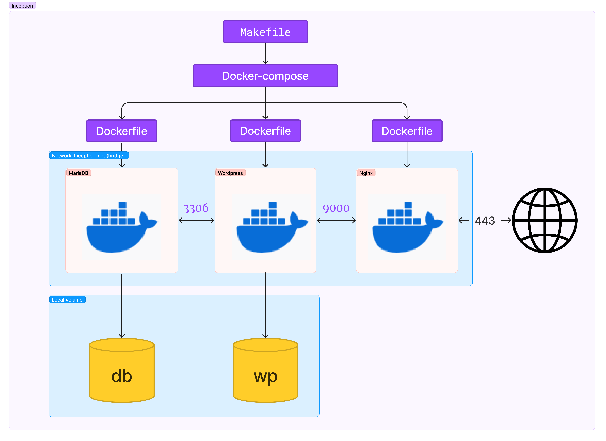

## Inception
42Seoul project

도커를 이용한 LEMP 스택 구성

### DNS
on Ubuntu  
127.0.0.1 taehykim > /etc/hosts

### MariaDB
listen 3306
root 초기화, wordpress가 사용할 유저 생성 

### Wordpress
listen 9000
wp_cli.phar로 wordpress다운로드 
wordpress 사용자 데이터 초기화 및 mariadb의 wordpress user 연결 
php-fpm 구동 

### Nginx
conf/default 파일 수정 
listen 443 port only 
openssl SSL/TLS 인증서 
